#Lab 10 Write Up
#Screenshots

###Continuous Integration Successful build
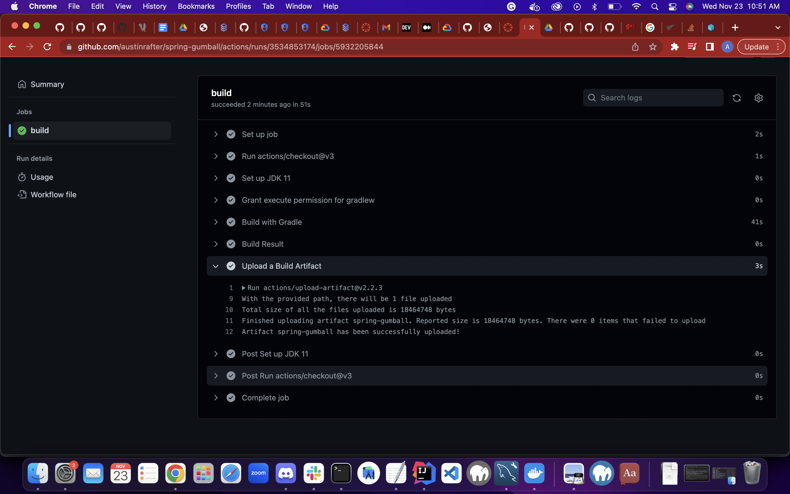

###Service Account roles
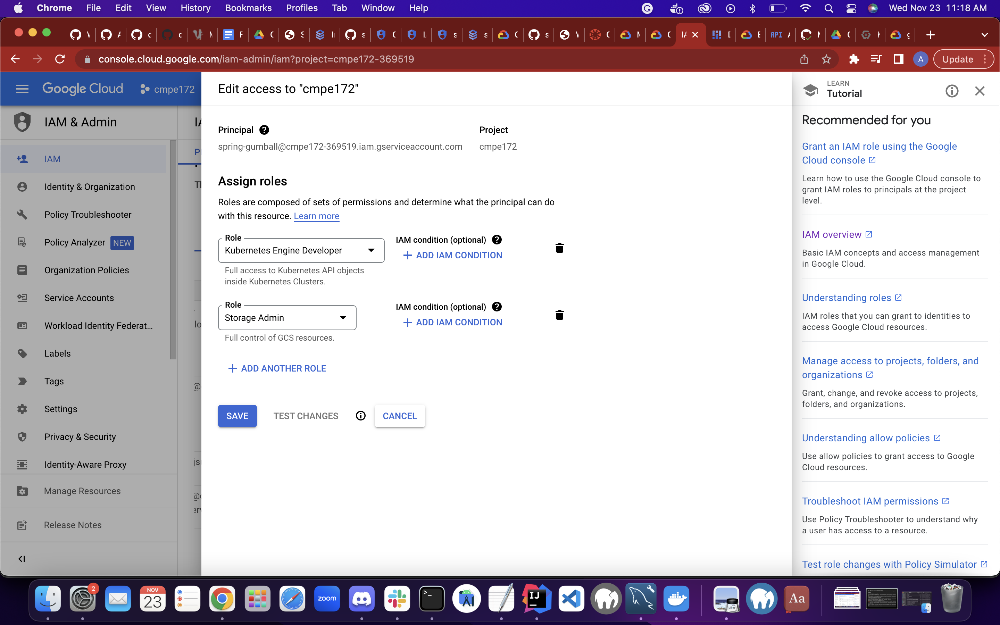

###Service Account key
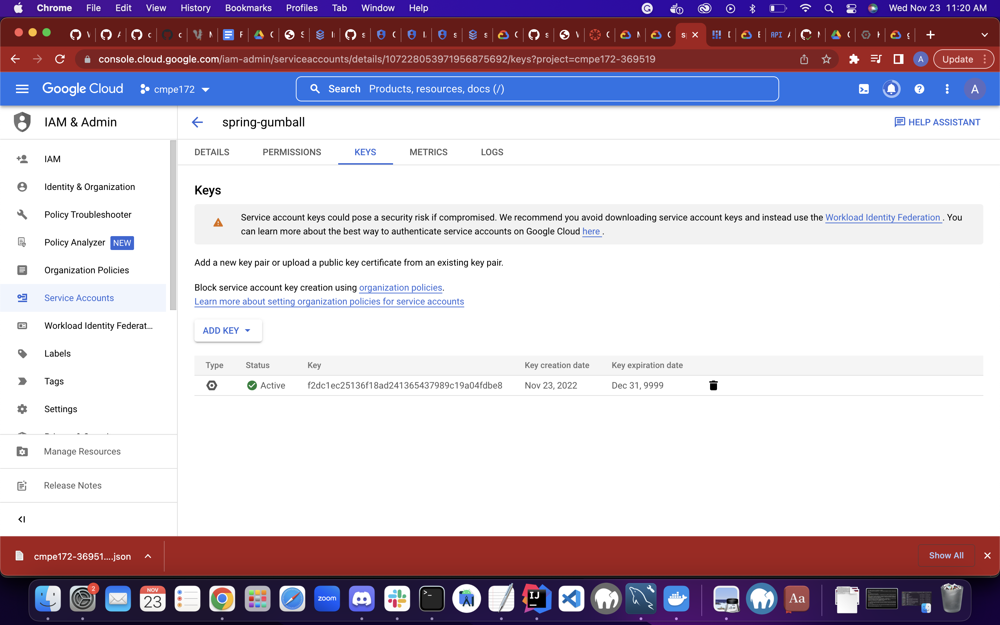

###Service Account key as github secret
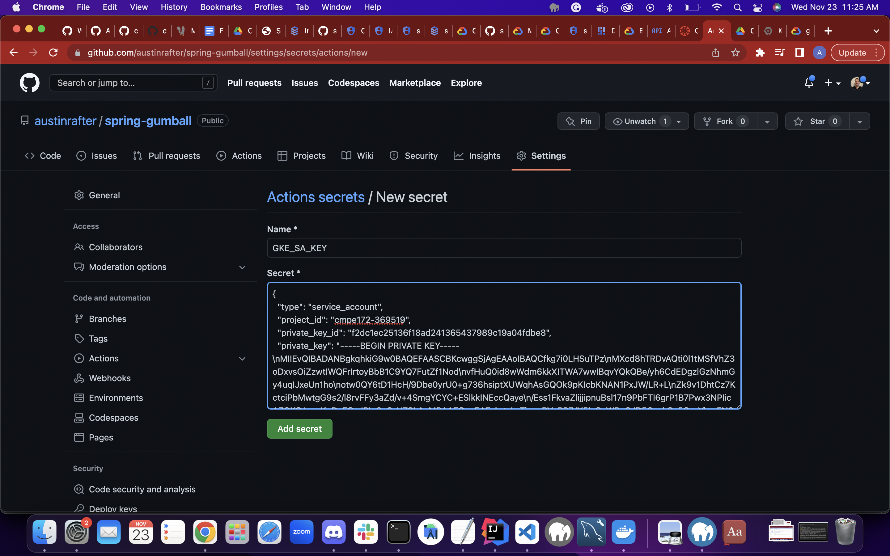

###Successful gke build 
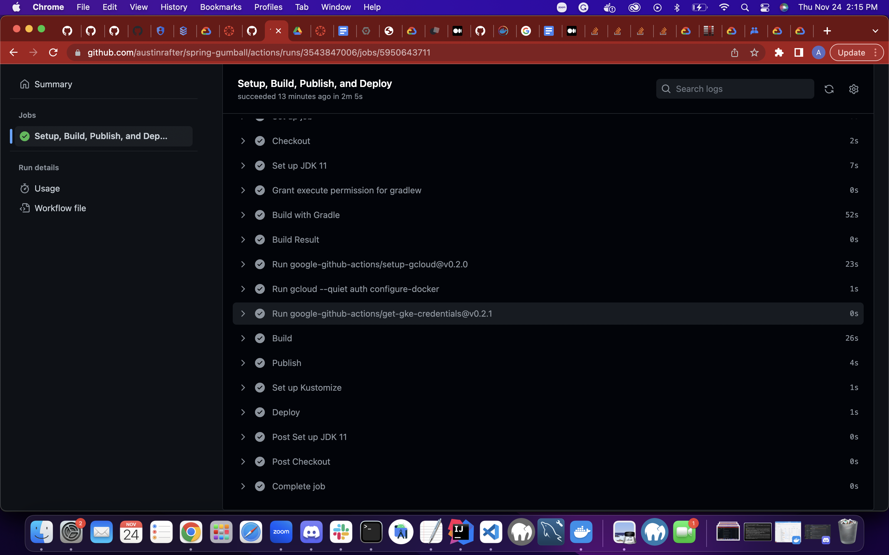

###Successful continuous deployment release
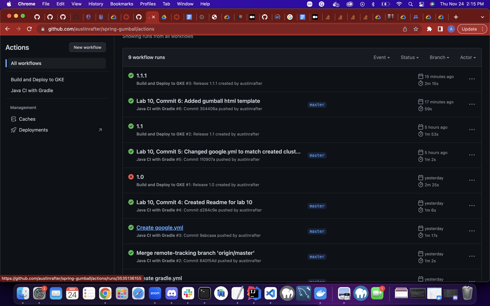

###Deployment created
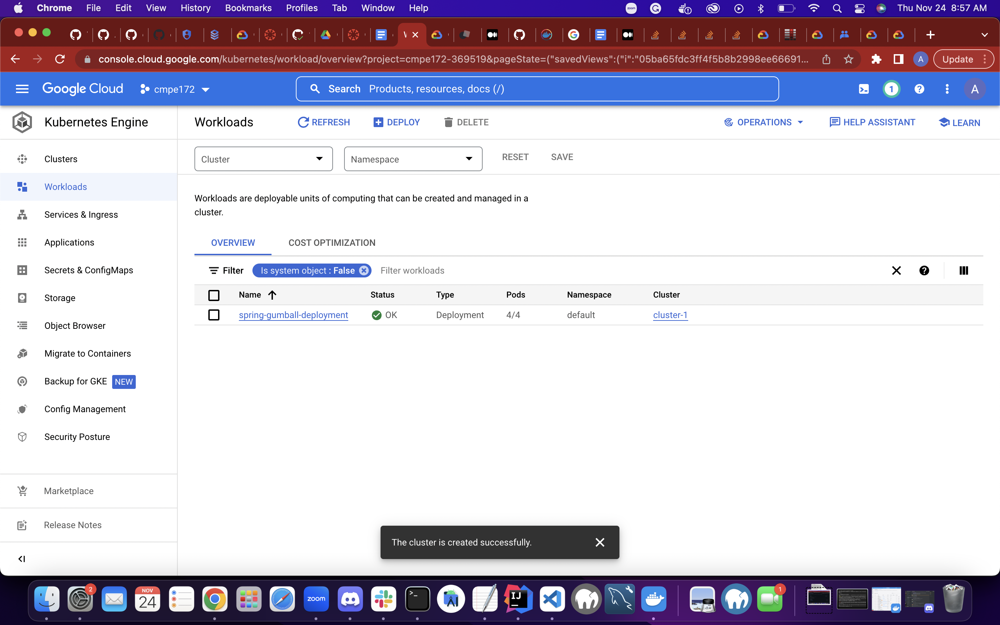

###Gumball Service Created
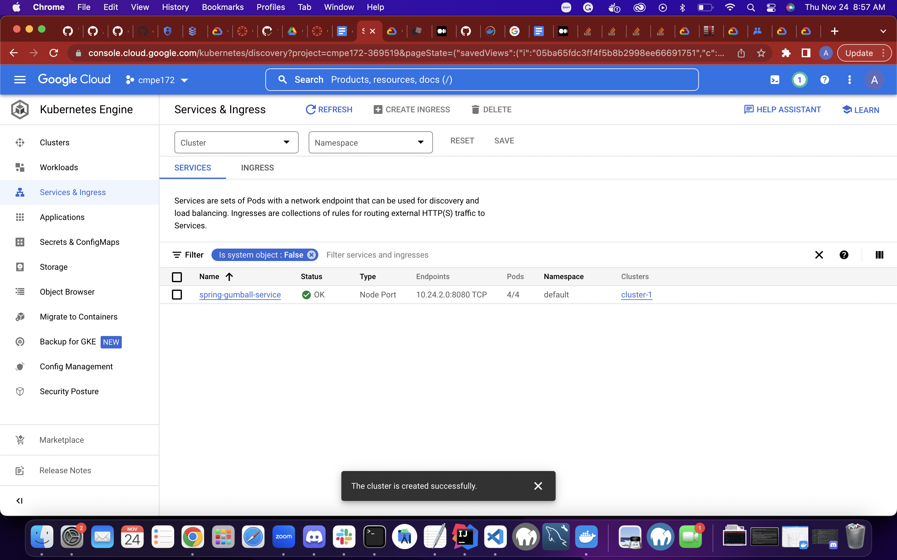

###Gumball Ingress creation
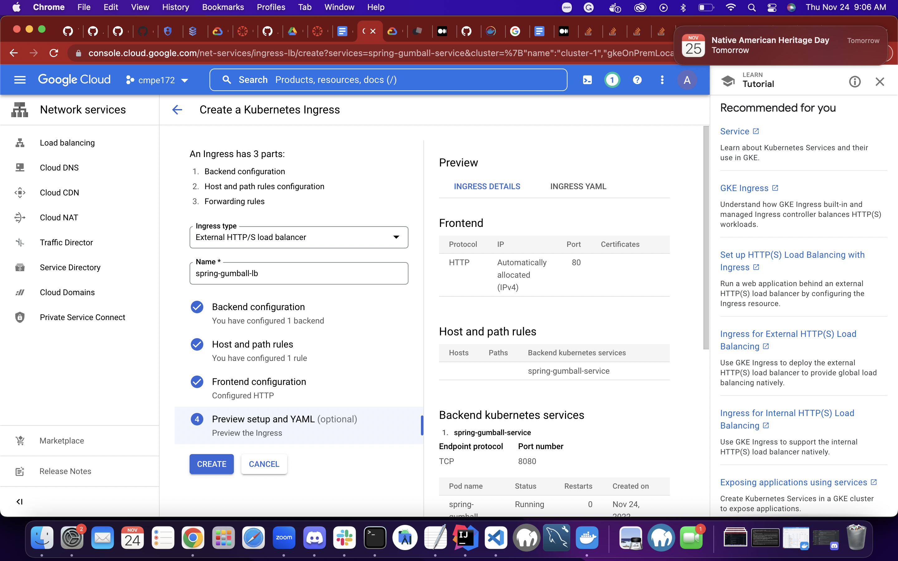

###Gumball Ingress Created
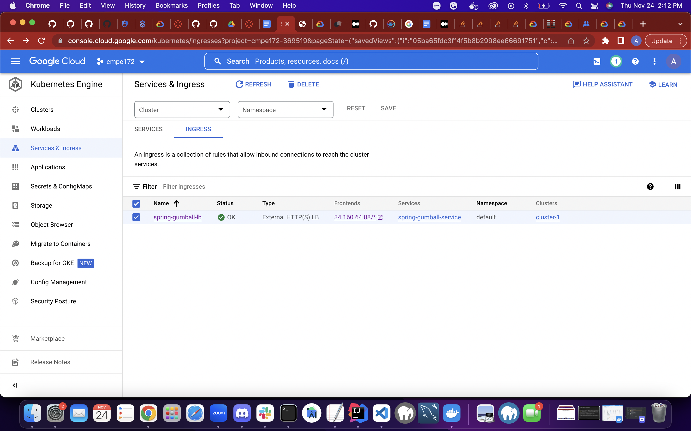

###LoadBalanced Gumball 
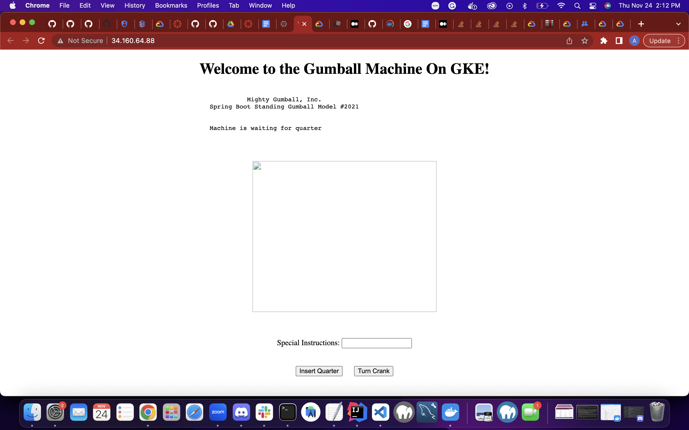

